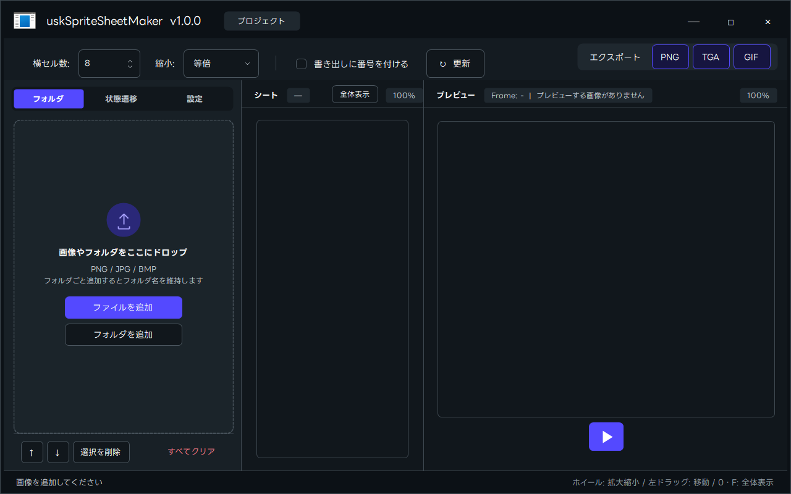
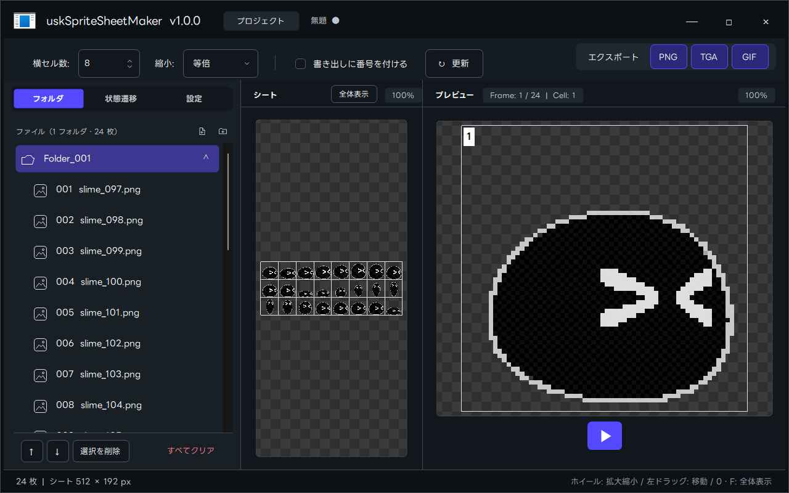
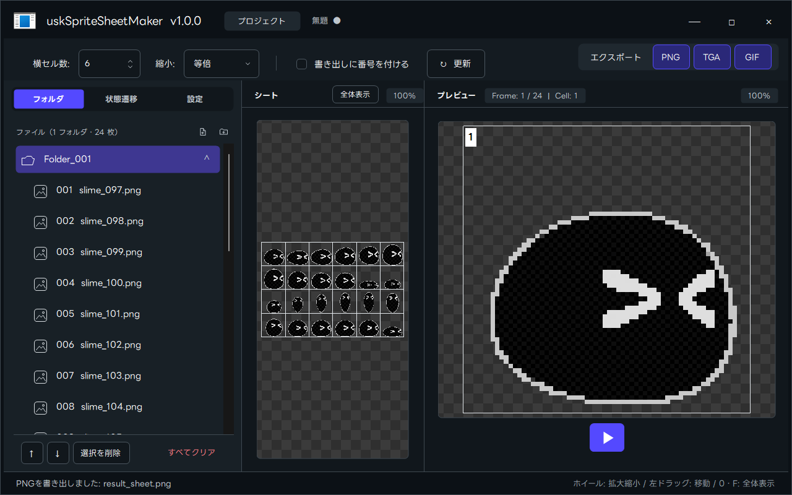
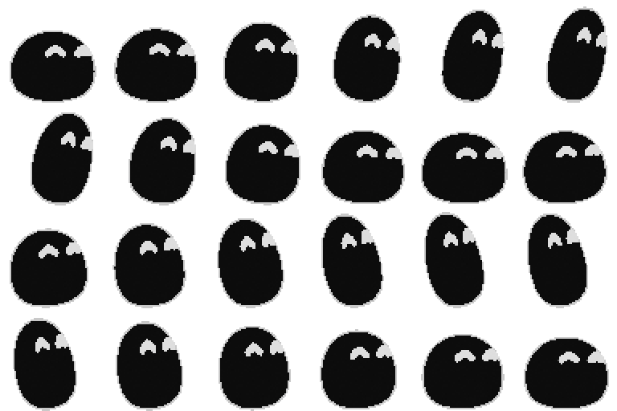

# uskSpriteSheetMaker

連番画像を並べてスプライトシート（PNG / TGA）とアニメーションGIFを作り、キャラクターやエフェクトの動きをその場で確かめられる Windows 用ツールです。
デザイナーが作った素材を、プログラマーがそのまま確認・調整でき、複数人でメモを残しながら受け渡せることを目指しています。

**English:** A Windows tool that arranges image sequences into a sprite sheet (PNG / TGA) or an animated GIF, and lets you preview character and effect animations right away — with simple physics, a sample terrain, sticky notes on the sheet, and a project file (`.smproj`) that bundles the images. UI languages: 日本語 / English / 简体中文 / Bahasa Indonesia. Windows 10/11, .NET Framework 4.8. MIT License. Download the exe from **Releases**.

> 個人開発です（現在のバージョン: v1.0.0）。仕様は変わることがあります。不具合・要望は Issues へどうぞ。

## ダウンロードと使いはじめ
1. [Releases](../../releases) から `uskSpriteSheetMaker.exe` をダウンロードします（展開・インストール不要。exe単体で動きます）。
2. `uskSpriteSheetMaker.exe` を起動し、連番画像（またはフォルダ）をウィンドウへドロップします。
3. 横セル数を決め、右上の PNG / TGA / GIF で書き出します。

### 使い方（画像）
| 1. 起動直後 | 2. 画像をドロップ |
| --- | --- |
|  |  |

| 3. 横セル数を調整 | 4. PNGで書き出し |
| --- | --- |
|  |  |

**できあがったシート**

## 動作環境
- Windows 10 / 11（64bit 推奨）
- .NET Framework 4.8（Windows 10 / 11 には標準で入っています）
- 画面の拡大率（DPI）とマルチモニターに対応

## できること
### シートを作る
- 画像・フォルダをドラッグ＆ドロップ、または左上のボタンで追加。ファイル名は自然順（`frame2` が `frame10` より前）で並びます。
- フォルダ（またはその中の画像）へ直接ドロップすると、新しいフォルダは作らず、選んだファイルすべてをそのフォルダへ名前の昇順で入れます。フォルダの右クリックメニュー「昇順に並べる」でも、いつでも並べ直せます（選択中の複数フォルダにも一括で使えます）。
- フォルダ単位で「行」を作ります。横セル数（列数）と縮小率（等倍・1/2・1/4・1/8）を指定できます。
- 画像の大きさが違うときは、列ごとの最大幅・行ごとの最大高さのセルに揃えます。
- セル番号とグリッドを常に表示。「書き出しに番号を付ける」で書き出し画像への焼き込みを切り替えられます。
- 加工: 黒背景素材を通常のアルファへ変換する「黒透過」、乗算／加算・強さ0〜100%の「カラー」。元の画像ファイルは変更しません。
- 並べ替え・フォルダ移動・削除・名前変更は、状態への割り当て（後述）を保ったまま行われ、すべて `Ctrl+Z`（元に戻す）/ `Ctrl+Y`（やり直し）に対応。フォルダをドラッグで移動する際は、どこに入るかを示す線が出ます。

### 書き出す（1クリック）
| 形式 | 内容 | 大きさの上限 |
| --- | --- | --- |
| PNG | 32bit（アルファ付き）のシート | 実質なし |
| TGA | 32bit 無圧縮のシート | 幅・高さとも 65,535 px（規格） |
| GIF | 開始〜終了セルのアニメーション。透明を保持。256色（固定パレット） | 1コマの幅・高さとも 65,535 px（規格） |

- 大きなシートでも書き出せます（16,384 × 16,384 px、24,000 × 24,000 px で確認済み）。シート全体を1枚のメモリに作らず、上から数行ずつ書き出します。
- 書き出しは別スレッドで実行し、状態欄に進み具合を表示します。`Esc` で中止でき、書きかけのファイルは残らず、同名の既存ファイルも壊しません。
- 画像が非常に大きいときは、画面のプレビューだけ自動で縮小します（書き出しは原寸）。
- 1枚の画像は 16,384 × 16,384 px まで（それを超える寸法の画像は、デコードする前に断ります。縮小してから追加してください）。

### 動きを確認する（プレビュー）
右側のプレビューは「デフォルト」「キャラクター」「エフェクト」を切り替えられます。
- **デフォルト**: 開始〜終了セルを指定した単体再生。FPS 指定。
- **キャラクター**: 待機、左右上下の移動、左右ジャンプ（踏み込み／滞空／着地）、攻撃1・2 を、セル範囲で割り当てて操作して確認できます。
  - 初期キー: `A` `D` 左右、`W` `S` 上下、`Space` ジャンプ、`G` `R` 攻撃1・2（変更可。マウスボタンも割り当て可）。
  - 片側の向きだけ用意すれば、「逆側反転」で反対向きを水平反転して使えます。未設定の動きは、移動／待機のアニメーションを続けます。
  - 速度・ジャンプ力・重力（画面比率の倍率）と、足元の位置を合わせる「接地オフセット」（-128〜128 px）を設定できます。ジャンプ力は既定値（1.0）のままで、見本の足場に乗れる高さに調整済みです。
  - 固定の見本地形（床・スロープ・直角の崖・下から上がれる足場）と当たり判定があります。「足場と地形を使う」で切り替え（オフで平らな床のみ）。
- **エフェクト**: 方向（X, Y。どの角度にも可）・速度・FPS を指定した単体再生。画面外に出たら中央から再開。
- 状態ごとに割り当てたセルは、シート上で色分けされます。

### 選択・割り当て・メモ
- シートの操作: ホイールで拡大縮小、左または中ボタンのドラッグで移動、ダブルクリック／`0`／`F` で全体表示へ戻す。
- セルの選択: `Shift`＋クリック（1つ）、`Shift`＋ドラッグ（範囲）、`Ctrl`＋`Shift`＋クリック（直前の選択からの範囲を追加）。選択はフォルダ一覧と連動し、削除・新規フォルダへ移動ができます。
- 状態遷移タブでセルを右クリック →「割り当て」→ 状態の行をクリックで、選択範囲をその状態の開始〜終了に設定します。
- シートの外側を右クリック →「メモを追加」で付箋メモ（外側をつかんで移動）。「プロジェクトをリセット」で初期状態へ（確認あり・元に戻せます）。
- 縦横の番号（シートの外側）は設定タブで表示できます。

### プロジェクトの保存
- 作業内容を `.smproj`（ZIP 形式。設定＋画像を同梱）に保存・読み込み。`Ctrl+S` / `Ctrl+O` / `Ctrl+Shift+S`、未保存の確認、最近使ったファイル。
- 画像を同梱するので、別のPCへファイル1つで渡せます。
- サンプルプロジェクト（キャラクター1体・132枚・状態遷移設定済み）を [Releases](../../releases) に添付しています。ダウンロードしてすぐ動きを確認できます。

### 言語
日本語 / English / 简体中文 / Bahasa Indonesia（設定タブで切り替え、再起動不要）。
English・中文・インドネシア語の訳は AI（GPT）が作ったもので、母語話者の確認は済んでいません。おかしな訳は Issues や Pull Request で教えてください（訳は `Localization/*.lang`）。

## キー・操作の一覧
| 操作 | 入力 |
| --- | --- |
| 元に戻す / やり直し | `Ctrl+Z` / `Ctrl+Y` |
| 保存 / 開く / 名前を付けて保存 | `Ctrl+S` / `Ctrl+O` / `Ctrl+Shift+S` |
| 削除 | `Delete` |
| 順序を上下 | `Ctrl+↑` / `Ctrl+↓` |
| 再生・停止 | `Space`（デフォルト／エフェクト時） |
| 全体表示 | `F` / `0` / ダブルクリック |
| 書き出し・割り当て状態の中止 | `Esc` |

## 保存される場所
- 設定: `%LOCALAPPDATA%\uskSpriteSheetMaker\settings.ini`
- 異常終了の記録: `%LOCALAPPDATA%\uskSpriteSheetMaker\error.log`
- 元の画像ファイルは変更しません。

## 既知の制限
- Windows 専用です。
- 実機のマウス・日本語入力（IME）での確認が十分でない操作があります（Shift＋ドラッグ、割り当て中の暗転範囲のクリックなど）。
- 大きな画像の書き出しは時間とメモリを使います（24,000 × 24,000 px の PNG で約80秒・ピーク約2.8GB）。
- GIF は 256 色（固定パレット）で、半透明は透明／不透明の二値になります。

## 安全性
- 通信は一切しません。元の画像ファイルは変更しません。
- `.smproj`（ZIP）は、展開先の外へ出るパスの拒否・Windows予約名の置き換え・サイズと個数の上限・zip爆弾の打ち切りを行ったうえで開きます。壊れたファイルや極端な値は、落ちずに読み込みだけ断ります。
- 画像でないファイルや壊れた画像は、ファイル名つきで知らせます。
- 書き出し・設定・プロジェクトの保存は、別名で書いてから置き換えるので、途中で止まっても既存のファイルを壊しません。
- 実行ファイルには署名がないため、Windows の SmartScreen が警告を出すことがあります。

## ビルド
- Visual Studio 2022、または `dotnet build SpriteSheetMaker.csproj -c Release`（.NET Framework 4.8 の開発者パックが必要）。
- テスト: `Tests/SpriteSheetMakerTests.csproj` をビルドして実行（単体テスト 88 件）。
- 開発履歴・仕様の経緯は [docs/DEVELOPMENT_HISTORY.md](docs/DEVELOPMENT_HISTORY.md)、翻訳の書式は [Localization/README.md](Localization/README.md)。

## フォントとアイコン
- 画面のフォントは LINE Seed JP を実行ファイルに同梱しており、PC に別途インストールされていなくても同じ書体で表示されます（読み込みに失敗した環境だけ Meiryo UI に戻ります）。中国語表示は、PC に入っていれば Microsoft YaHei UI（ライセンス上同梱不可）、なければ Meiryo UI を使います。
- LINE Seed JP は SIL Open Font License 1.1 で提供されており、ライセンス全文は docs/third_party_licenses/LINE_Seed_JP_OFL.txt にあります。
- アイコンは作者が AI で生成したモックアップを元に作成したもので、権利は作者にあります。

## ライセンス
ソースコードは [MIT License](LICENSE)。同梱している LINE Seed JP フォントは別ライセンス（SIL OFL 1.1、docs/third_party_licenses/LINE_Seed_JP_OFL.txt）です。
